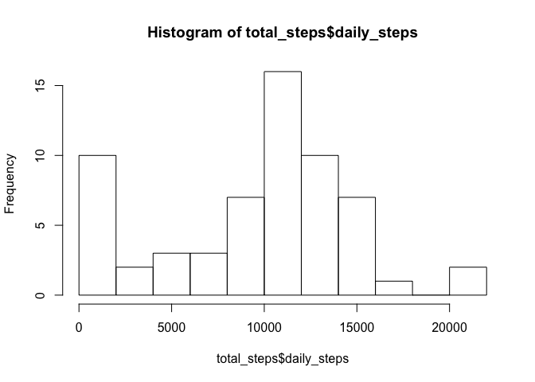
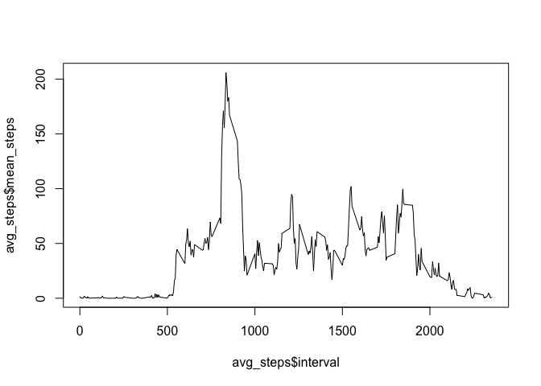
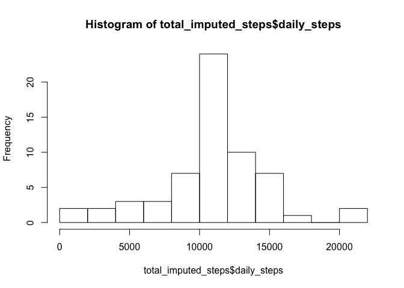
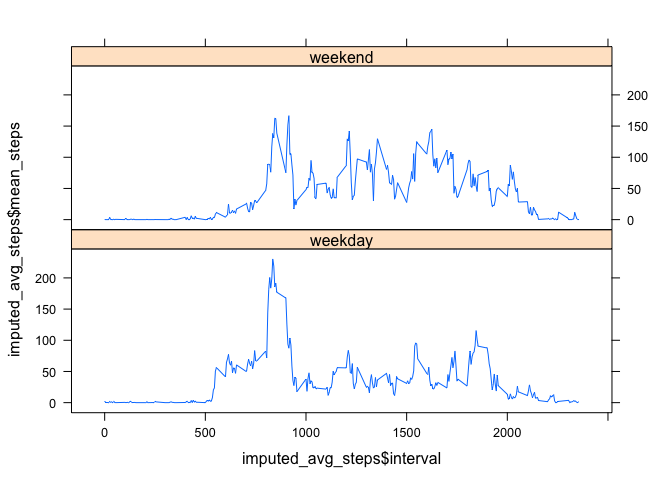

# Reproducible Research: Peer Assessment 1

This report was completed as an assignment for the Reproducible Research course.

The original assignment questions and description of the data can be found in the readme.

## Loading and preprocessing the data

The data used for this report can be found [here](https://d396qusza40orc.cloudfront.net/repdata%2Fdata%2Factivity.zip).

The data was loaded from the file "activity.csv," found within the zip file (included in the github repository). Most manipulations to the data used the dplyr library.

```r
# Loads the data
unzip("activity.zip")
activity <- read.csv("activity.csv")

# Converts dates and data frame format
activity$date <- as.Date(activity$date)
library(dplyr)
data <- tbl_df(activity)
```

## What is mean total number of steps taken per day?

To find the mean total steps per day for this user, a summary table was first created.


```r
data <- group_by(data, date)
total_steps <- summarise(data, sum(steps, na.rm = TRUE))
names(total_steps)[2] <- "daily_steps"
total_steps
```

```
## Source: local data frame [61 x 2]
## 
##          date daily_steps
## 1  2012-10-01           0
## 2  2012-10-02         126
## 3  2012-10-03       11352
## 4  2012-10-04       12116
## 5  2012-10-05       13294
## 6  2012-10-06       15420
## 7  2012-10-07       11015
## 8  2012-10-08           0
## 9  2012-10-09       12811
## 10 2012-10-10        9900
## ..        ...         ...
```

Next, a histogram was plotted.


```r
hist(total_steps$daily_steps, breaks = 10)
```

 

Finally, the mean and median of the daily total steps were calculated.


```r
summarise(total_steps, mean(daily_steps), median(daily_steps))
```

```
## Source: local data frame [1 x 2]
## 
##   mean(daily_steps) median(daily_steps)
## 1           9354.23               10395
```

## What is the average daily activity pattern?

First, the mean steps at each interval were plotted.

```r
data <- group_by(data, interval)
avg_steps <- summarise(data, mean(steps, na.rm = TRUE))
names(avg_steps)[2] <- "mean_steps"
plot(avg_steps$interval, avg_steps$mean_steps, type = "l")
```

 

Then, the interval with the max number of steps was calculated.

```r
max_steps <- filter(avg_steps, mean_steps == max(mean_steps))
max_steps[1]
```

```
## Source: local data frame [1 x 1]
## 
##   interval
## 1      835
```

## Imputing missing values

First, the total missing values were calculated

```r
na_matches <- is.na(data$steps)
num_na <- sum(na_matches)
num_na
```

```
## [1] 2304
```

To fill in the NAs with actual values, the mean of each interval (calculated in the previous section) was used to fill in the NAs, as this method seemed to produce somewhat realistic results, essentially assuming a regular daily pattern.

These values were used to replace the NAs in the dataset.

```r
imputed_data <- data
imputed_data$steps[na_matches] <- avg_steps$mean_steps[match(
  imputed_data$interval[na_matches],
  avg_steps$interval)]
```

Using this data, an updated histogram was created, and the mean and median were recalculated.

```r
imputed_data <- group_by(imputed_data, date)
total_imputed_steps <- summarise(imputed_data, sum(steps))
names(total_imputed_steps)[2] <- "daily_steps"

hist(total_imputed_steps$daily_steps, breaks = 10)
```

 

```r
summarise(total_imputed_steps, mean(daily_steps), median(daily_steps))
```

```
## Source: local data frame [1 x 2]
## 
##   mean(daily_steps) median(daily_steps)
## 1          10766.19            10766.19
```

As can be seen from the results, it is important to note that the days with the fewest number of steps decreased, and the days closest to the mean increased. This makes sense, as days that had only NA values were originally reported as having zero steps, but after imputing the values, these days had the exact mean number of steps due to the imputation method chosen.


## Are there differences in activity patterns between weekdays and weekends?

First, a new factor variable was added to the data frame to indicate whether a particular day was a weekday or weekend.

```r
# Simple function that determines the type of day
wknd <- function(str) {
  if(substr(str, 1, 1) == "S") {
    "weekend"
  }
  else {
    "weekday"
  }
}

imputed_data <- mutate(imputed_data, day_type = sapply(weekdays(date), wknd))
imputed_data$day_type <- as.factor(imputed_data$day_type)
```

Finally, the average steps at each interval were calculated for weekdays and weekends.

```r
imputed_data <- group_by(imputed_data, interval, day_type)
imputed_avg_steps <- summarise(imputed_data, mean(steps))
names(imputed_avg_steps)[3] <- "mean_steps"

library(lattice)
xyplot(imputed_avg_steps$mean_steps ~ imputed_avg_steps$interval |
         imputed_avg_steps$day_type, layout = c(1, 2), type = "l")
```

 

As can be seen, there seems to be a clear difference between weekdays and weekends, with more steps throughout the day on weekends.
